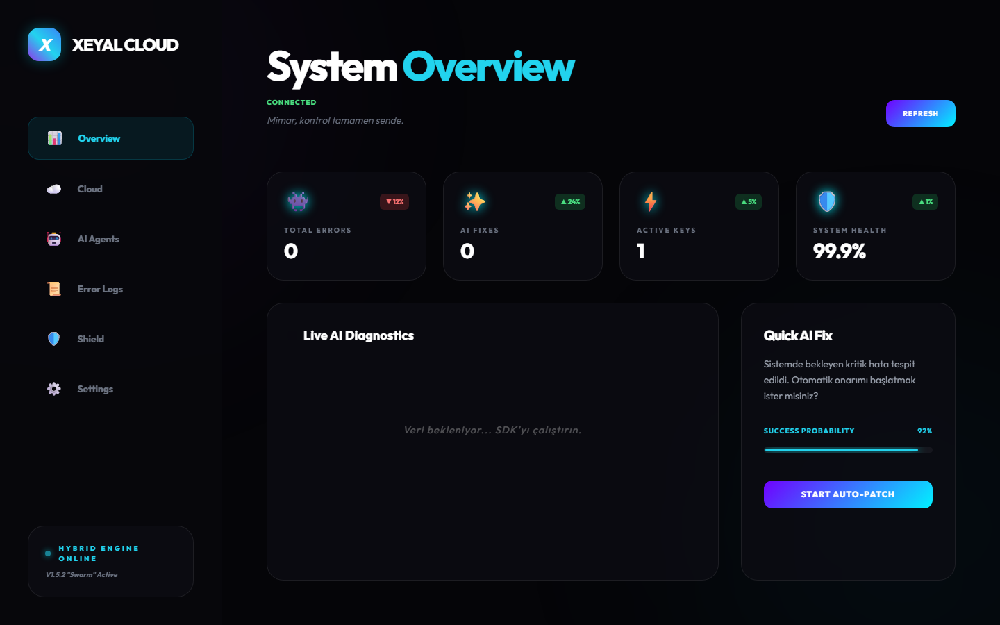
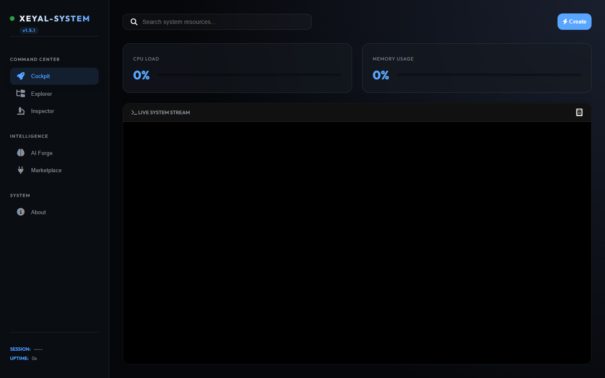
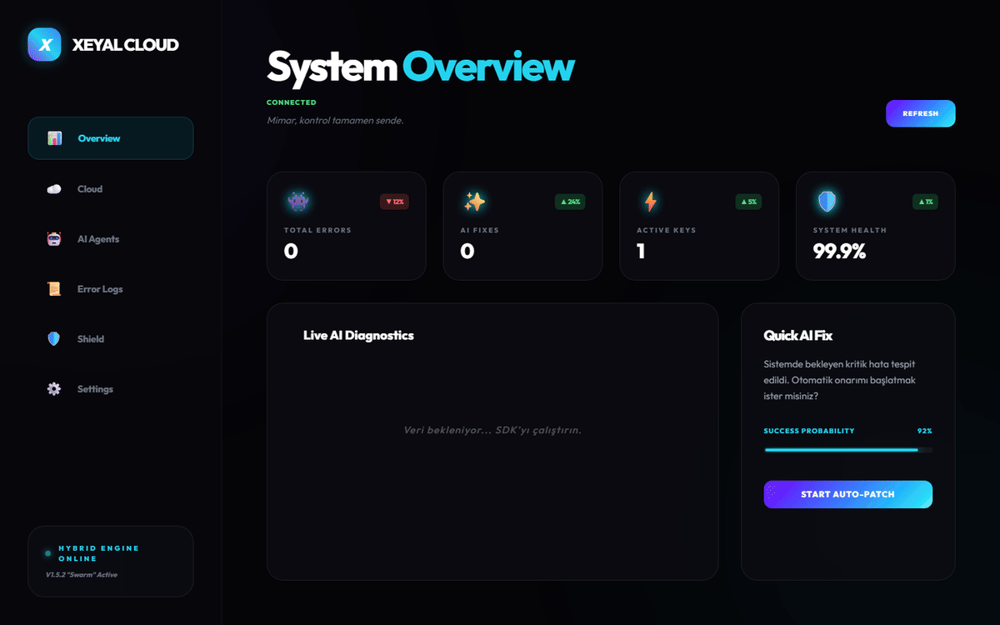
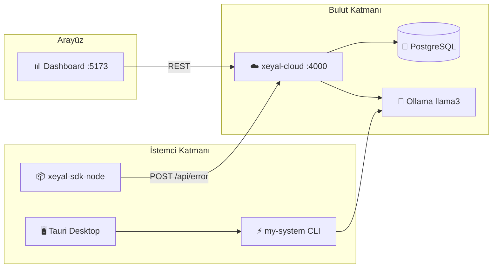

<div align="center">


<br/><br/>

[](https://github.com/xeyal9032/xeyal-system)
[](LICENSE)
[](https://nodejs.org)
[](https://ollama.com)
[](https://tauri.app)
[](https://postgresql.org)

**Tek komutla geliştirme ortamını ayağa kaldır · Hataları yerel AI ile analiz et · Bulutta izle ve onar**

[🚀 Hızlı Başlangıç](#-hızlı-başlangıç) ·
[🖥️ Masaüstü EXE](#-masaüstü-uygulaması-exe) ·
[📸 Ekran Görüntüleri](#-ekran-görüntüleri) ·
[🏗️ Mimari](#%EF%B8%8F-mimari) ·
[📦 Modüller](#-modüller) ·
[🤝 Katkı](#-katkı)

<br/>


</div>

---

## ✨ Xeyal System Nedir?

**Xeyal System**, geliştiriciler için tasarlanmış **otonom bir Developer OS** ve **AI destekli hata izleme SaaS platformudur**. Port çakışmalarından framework algılamaya, yerel Ollama analizinden bulut dashboard'a kadar tüm geliştirme döngüsünü tek ekosistemde birleştirir.

<table>
<tr>
<td width="50%" valign="top">

### 🖥️ Developer OS
- Tek komut: `npx xeyal-system dev`
- Node · Python · Rust · PHP · Ruby desteği
- Otomatik port temizliği & bağımlılık kurulumu
- Tauri masaüstü + Web dashboard
- AI Swarm ajanları (Coder-Pro, Guardian, Fixer-Bot)

</td>
<td width="50%" valign="top">

### ☁️ Cloud SaaS
- SDK ile hata yakalama & breadcrumb
- Hybrid AI: Ollama + Cloud fallback
- PostgreSQL ile kalıcı hata arşivi
- React dashboard ile canlı izleme
- Docker Compose ile tek komut deploy

</td>
</tr>
</table>

---

## 🖥️ Masaüstü Uygulaması (EXE)

> **Xeyal-System'in kalbi** — Tauri 2 ile yazılmış, glassmorphism tasarımlı **Autonomous Developer OS** masaüstü paneli.  
> Cloud dashboard'dan çok daha zengin: Cockpit, AI Forge, Swarm, Skills Hub ve yerel Ollama entegrasyonu tek pencerede.

<p align="center">
  
</p>

<p align="center">
  
</p>

<table>
<tr>
<td width="33%" align="center">
<br/>
<sub><b>Initialize System</b> — ilk açılış</sub>
</td>
<td width="33%" align="center">
<br/>
<sub><b>Cockpit</b> — proje &amp; log kontrolü</sub>
</td>
<td width="33%" align="center">
<br/>
<sub><b>AI Forge</b> — Ollama proje üretici</sub>
</td>
</tr>
</table>

### 📥 Kurulum (Windows)

<table>
<tr>
<th width="28%">Yöntem</th>
<th width="72%">Adımlar</th>
</tr>
<tr>
<td><b>🎁 ZIP Paketi</b><br/><sub>Önerilen</sub></td>
<td>

1. `xeyal-system-v1.5.1-windows.zip` dosyasını çıkarın  
2. `install.ps1` → sağ tık → **PowerShell ile Çalıştır**  
3. Kurulum sihirbazı EXE'yi yükler, masaüstü kısayolu oluşturur  

</td>
</tr>
<tr>
<td><b>⚙️ NSIS Installer</b></td>
<td>

Doğrudan çalıştırın: `xeyal-system_1.5.1_x64-setup.exe`  
*(build: `my-system/desktop-app/src-tauri/target/release/bundle/nsis/`)*

</td>
</tr>
<tr>
<td><b>👨‍💻 Geliştirici</b></td>
<td>

```bash
cd my-system && npm install
npm run desktop        # dev modu
npm run build:desktop  # .exe üret
```

</td>
</tr>
</table>

**Gereksinimler:** Windows 10/11 · Node.js ≥ 20 · Ollama (AI için, opsiyonel)

📖 Detaylı kurulum: **[docs/DESKTOP.md](docs/DESKTOP.md)**

[](docs/DESKTOP.md)
[](docs/DESKTOP.md)
[](https://tauri.app)

---

## 📸 Ekran Görüntüleri

### 🖥️ Masaüstü — Skills Hub & AI Ajanları

<p align="center">
  
</p>

> OpenClaw, Claude Code, Codex ve daha fazlası — tek tıkla başlat.

<br/>

### 🌐 Cloud Dashboard — Canlı Hata Monitörü

<p align="center">
  
</p>

> Glassmorphism tasarımlı React paneli: canlı hata akışı, AI analiz sonuçları, auto-patch simülasyonu.

<br/>

### ⚡ my-system Web Dashboard

<p align="center">
  
</p>

> Socket.IO destekli canlı metrik paneli — port izleme, servis durumu ve otonom log akışı.

<br/>

### 🎬 Demo

<p align="center">
  
</p>

> Dashboard sekmeleri, my-system paneli ve Forge UI — gerçek uygulama ekran kaydı.

<table align="center">
<tr>
<td align="center" width="33%">

<br/><sub><code>xeyal-system dev</code></sub>
</td>
<td align="center" width="33%">

<br/><sub>Canlı metrik &amp; log akışı</sub>
</td>
<td align="center" width="33%">

<br/><sub>%100 yerel &amp; gizli</sub>
</td>
</tr>
</table>

---

## 🏗️ Mimari




---

## 📦 Modüller

<table>
<thead>
<tr>
<th align="left">Modül</th>
<th align="left">Teknoloji</th>
<th align="left">Port</th>
<th align="left">Açıklama</th>
</tr>
</thead>
<tbody>
<tr>
<td><b>my-system</b></td>
<td>Node.js · Tauri 2 · Express</td>
<td><code>3000</code></td>
<td>Otonom geliştirici OS, CLI, AI swarm, healer</td>
</tr>
<tr>
<td><b>xeyal-cloud</b></td>
<td>Express · PostgreSQL · Jest</td>
<td><code>4000</code></td>
<td>Production-ready hata raporlama &amp; AI analiz API</td>
</tr>
<tr>
<td><b>xeyal-dashboard</b></td>
<td>React · Vite · Tailwind · Framer Motion</td>
<td><code>5173</code></td>
<td>Cyber/glass temalı yönetim paneli</td>
</tr>
<tr>
<td><b>xeyal-sdk-node</b></td>
<td>Axios · stacktrace-parser</td>
<td>—</td>
<td>Resmi Node.js hata izleme SDK</td>
</tr>
<tr>
<td><b>demo-app</b></td>
<td>Express</td>
<td><code>5000</code></td>
<td>Basit test uygulaması</td>
</tr>
</tbody>
</table>

---

## 🚀 Hızlı Başlangıç

### Gereksinimler

- **Node.js** ≥ 20
- **PostgreSQL** 15 (Cloud için)
- **Ollama** (AI özellikleri için, opsiyonel)
- **Rust** (Tauri desktop build için)

### 2️⃣ Masaüstü Uygulamasını Kur (Önerilen)

```powershell
cd my-system
.\install.ps1
# veya geliştirici modu:
npm install && npm run desktop
```

Detaylı rehber: [docs/DESKTOP.md](docs/DESKTOP.md)

### 3️⃣ Tüm Ekosistemi Başlat

```bash
git clone https://github.com/xeyal9032/xeyal-system.git
cd xeyal-system
node launch-all.js
```

Bu komut paralel olarak başlatır:
- `xeyal-cloud` → Backend API
- `xeyal-dashboard` → React panel
- `my-system` → Developer OS

### 4️⃣ Sadece Developer OS (CLI)

```bash
cd my-system
npm install
npx xeyal-system dev
```

### 5️⃣ Docker ile Cloud Stack

```bash
docker compose up -d
```

| Servis | URL |
|--------|-----|
| Backend API | http://localhost:4000 |
| Dashboard | http://localhost:80 |
| PostgreSQL | localhost:5432 |
| my-system Dashboard | http://localhost:3000 |

### 6️⃣ SDK Entegrasyonu

```javascript
import xeyal from '@xeyal/sdk';

xeyal.init({
  apiKey: 'YOUR_API_KEY',
  projectName: 'My-App',
  apiUrl: 'http://localhost:4000/api',
  autoCapture: true
});

try {
  // kodunuz...
} catch (error) {
  xeyal.captureError(error);
}
```

---

## 🧰 CLI Komutları

<table>
<tr>
<td>

| Komut | Açıklama |
|-------|----------|
| `dev` | Ortamı otomatik başlat |
| `create` | Proje iskeleti oluştur |
| `doctor` | Derin sistem diagnostiği |
| `fix` | Port & ortam onarımı |
| `skills` | AI ajan yönetimi |

</td>
<td>

| Komut | Açıklama |
|-------|----------|
| `cockpit` | TUI kokpit (blessed) |
| `snapshot` | Tam sistem yedeği |
| `explain` | Ollama ile hata açıklama |
| `marketplace` | Eklenti marketi |
| `status` | Sistem sağlık özeti |

</td>
</tr>
</table>

---

## 🧠 AI Özellikleri

<table align="center">
<tr>
<td align="center" width="25%">
<h3>🤖 Coder-Pro</h3>
<p>Full-stack kod üretimi<br/>Laravel · Next.js · SPA</p>
</td>
<td align="center" width="25%">
<h3>🛡️ Guardian</h3>
<p>Güvenlik taraması<br/>Lint &amp; vulnerability</p>
</td>
<td align="center" width="25%">
<h3>🔧 Fixer-Bot</h3>
<p>Otomatik hata onarımı<br/>Patch engine</p>
</td>
<td align="center" width="25%">
<h3>🏗️ Architect</h3>
<p>Proje iskeleti<br/>21+ Forge şablonu</p>
</td>
</tr>
</table>

---

## 🛠️ Tech Stack

<div align="center">


</div>

---

## 📁 Proje Yapısı

```
xeyal-system/
├── my-system/           # Developer OS (CLI + Core + Tauri)
│   ├── cli/             # Commander.js giriş noktası
│   ├── core/            # intelligence · runtime · system
│   ├── commands/        # 17 CLI komutu
│   ├── plugins/         # Eklenti sistemi
│   ├── swarm/           # Çoklu AI ajan
│   └── desktop-app/     # Tauri 2 masaüstü GUI
├── xeyal-cloud/         # Express backend API
├── xeyal-dashboard/     # React yönetim paneli
├── xeyal-sdk-node/      # Node.js SDK
├── demo-app/            # Test uygulaması
├── docs/assets/         # README görselleri
├── launch-all.js        # Cluster orchestrator
└── docker-compose.yml   # Postgres + Backend + Dashboard
```

---

## 🔄 CI/CD

GitHub Actions ile otomatik test ve build:

- ✅ `xeyal-cloud` — Jest testleri (PostgreSQL servisi ile)
- ✅ `xeyal-dashboard` — Vite production build
- 🚀 Main branch deploy placeholder

---

## 🤝 Katkı

1. Fork edin
2. Feature branch oluşturun (`git checkout -b feature/amazing`)
3. Commit edin (`git commit -m 'feat: harika özellik eklendi'`)
4. Push edin (`git push origin feature/amazing`)
5. Pull Request açın

---

## 👤 Geliştirici

<div align="center">

**Khayal Jamilli** — Web Designer & Developer @ OstWind Group

[](https://github.com/xeyal9032)
[](https://linkedin.com/in/khayaljamilli9032)
[](https://frontend.ostwind.az/)
[](https://instagram.com/xeyal9032)

</div>

---

<div align="center">

**⭐ Beğendiyseniz yıldız vermeyi unutmayın!**

<br/>

*"Kurulum yok. Konfigürasyon yok. %100 Gizlilik. %100 Verimlilik."* 🛡️🦾

<br/>


</div>
