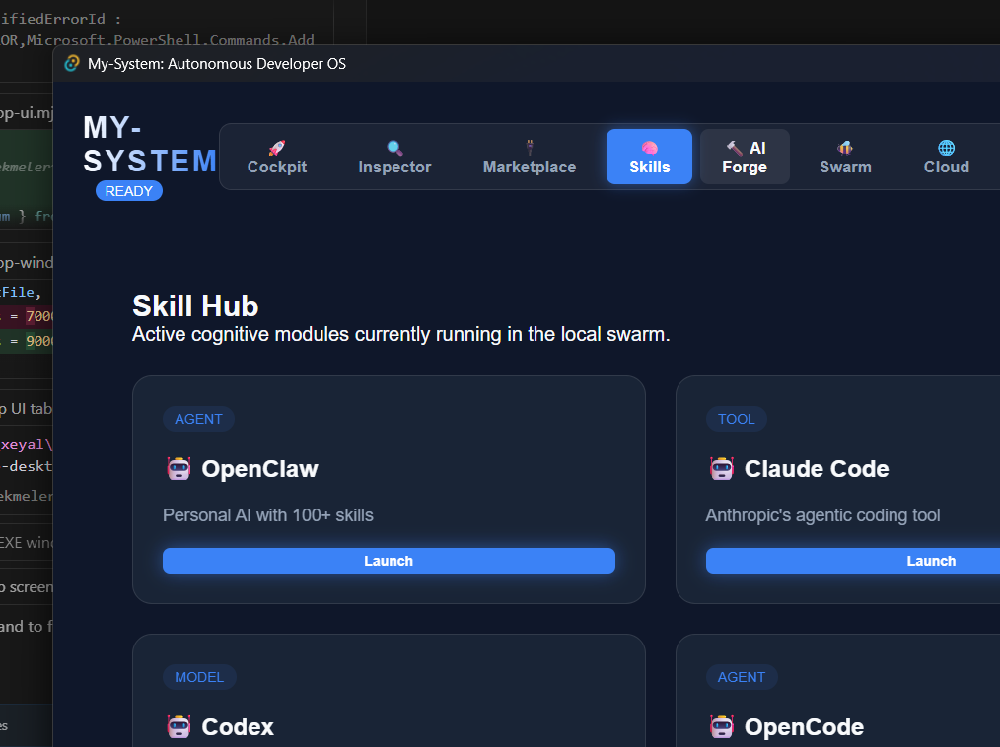
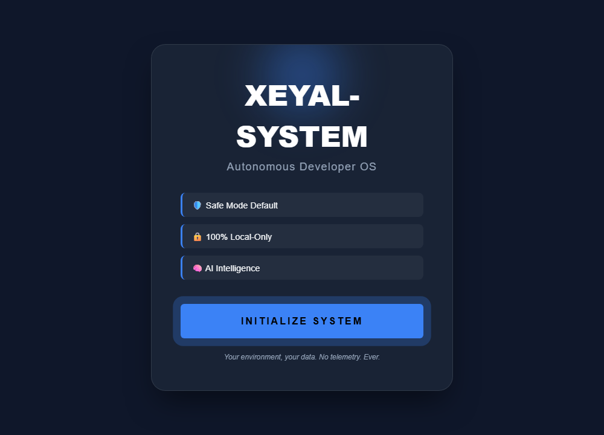
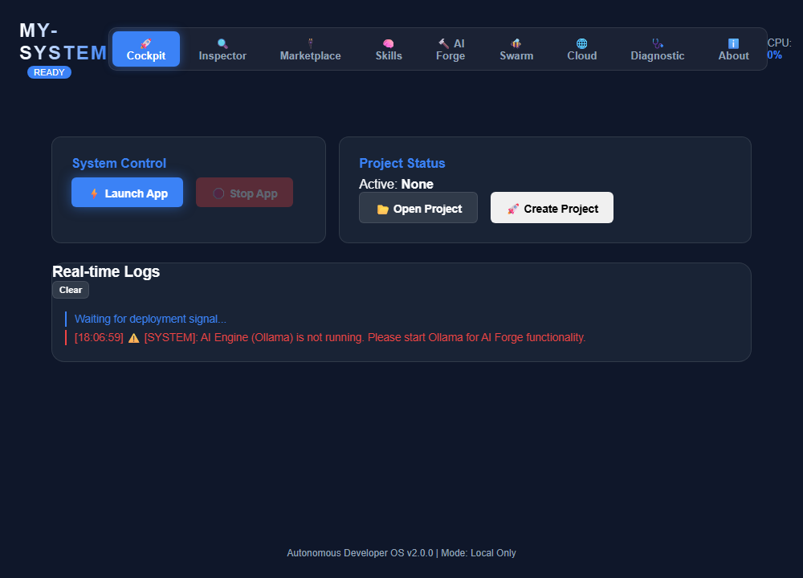
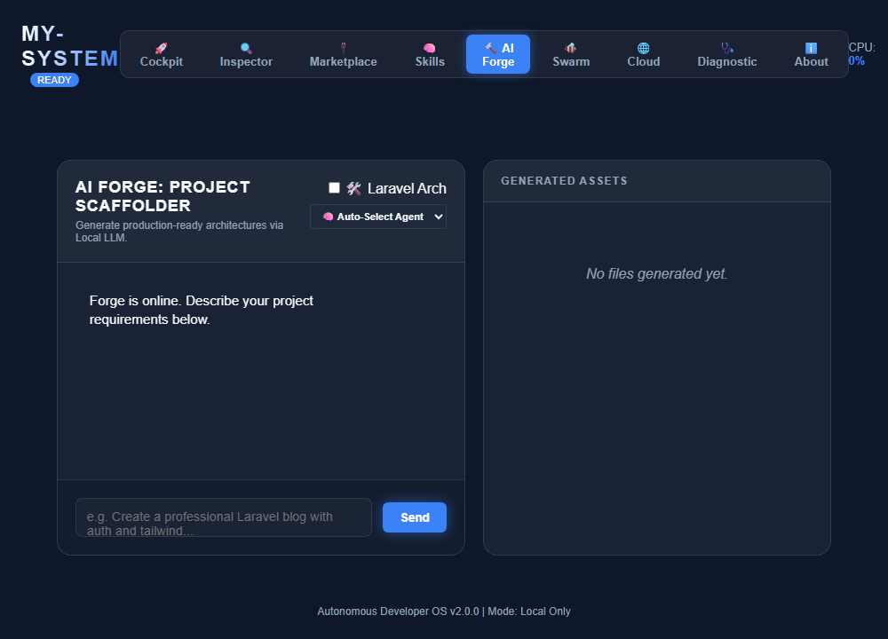
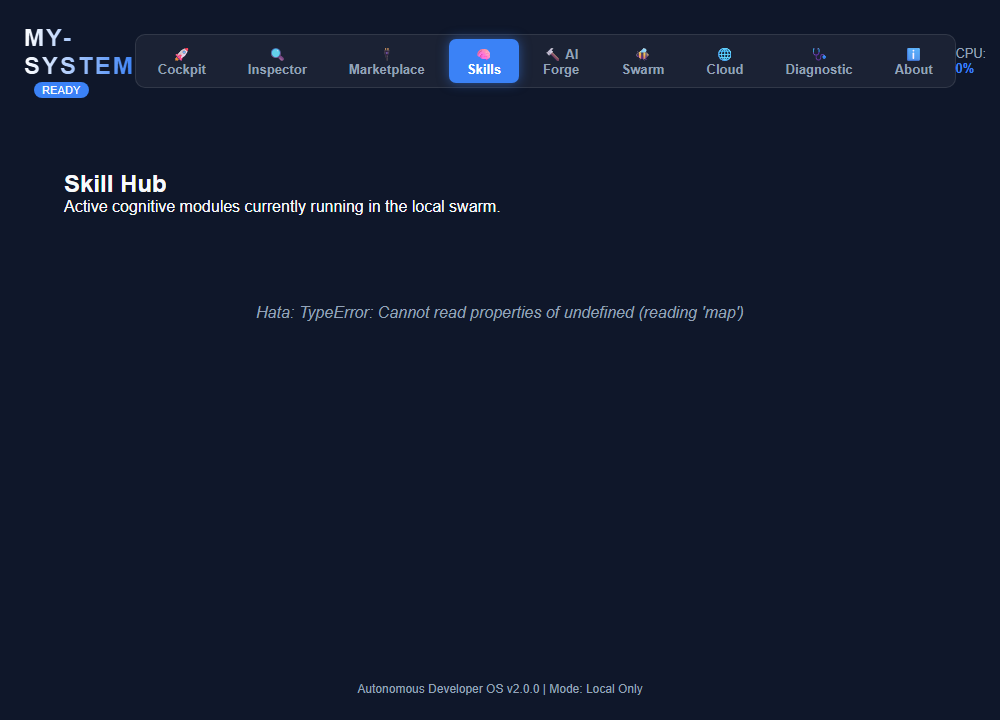
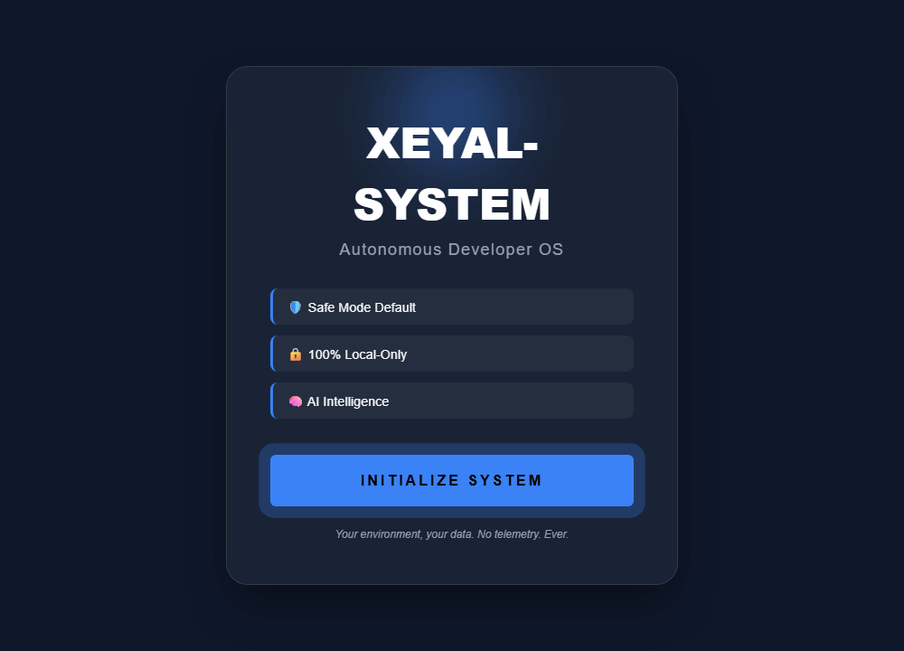

# 🖥️ Xeyal-System Masaüstü Uygulaması

**Autonomous Developer OS** — Tauri 2 ile geliştirilmiş, yerel AI destekli profesyonel masaüstü kontrol paneli.

<p align="center">
  
</p>

> Gerçek `.exe` uygulamasından alınmış ekran görüntüsü — Skill Hub, AI ajanları ve Launch kontrolleri.

---

## ✨ Özellikler

| Sekme | Açıklama |
|-------|----------|
| 🚀 **Cockpit** | Proje başlat/durdur, canlı loglar, sistem kontrolü |
| 🔍 **Inspector** | Port ve ağ izleme |
| 🔌 **Marketplace** | Eklenti kataloğu |
| 🧠 **Skills** | OpenClaw, Claude Code, Codex — AI skill hub |
| 🔨 **AI Forge** | Ollama ile proje iskeleti üretimi |
| 🐝 **Swarm** | Çoklu otonom ajan orkestrasyonu |
| 🌐 **Cloud** | xeyal-cloud entegrasyonu |
| 🩺 **Diagnostic** | Sistem sağlık taraması |

---

## 📸 Ekran Görüntüleri

<table>
<tr>
<td width="50%" align="center">
<strong>Hoş Geldin Ekranı</strong><br/><br/>

</td>
<td width="50%" align="center">
<strong>Cockpit — Komuta Merkezi</strong><br/><br/>

</td>
</tr>
<tr>
<td width="50%" align="center">
<strong>AI Forge — Proje Oluşturucu</strong><br/><br/>

</td>
<td width="50%" align="center">
<strong>Skills Hub — AI Ajanları</strong><br/><br/>

</td>
</tr>
</table>

<p align="center">
  
</p>

---

## 📥 Kurulum (Son Kullanıcı)

### Yöntem A — ZIP Paketi (Önerilen)

1. **Release ZIP** indirin veya proje kökündeki paketi kullanın:
   ```
   xeyal-system-v1.5.1-windows.zip
   ```

2. ZIP'i bir klasöre çıkarın (Masaüstü veya Belgelerim).

3. `install.ps1` dosyasına **sağ tık** → **PowerShell ile Çalıştır**.

4. Script otomatik olarak:
   - Node.js kontrol eder
   - `npm install` çalıştırır
   - `xeyal-system_1.5.1_x64-setup.exe` kurulum sihirbazını başlatır
   - Sistem dosyalarını `%LOCALAPPDATA%\xeyal-system` konumuna kopyalar
   - Masaüstüne **Xeyal-System** kısayolu oluşturur

5. Masaüstündeki kısayola tıklayın veya Başlat menüsünden **xeyal-system** uygulamasını açın.

### Yöntem B — Doğrudan EXE Kurulumu

Derlenmiş NSIS installer:

```
my-system/desktop-app/src-tauri/target/release/bundle/nsis/
└── xeyal-system_1.5.1_x64-setup.exe
```

Çift tıklayın → kurulum sihirbazını takip edin → uygulama Başlat menüsüne eklenir.

### Yöntem C — Geliştirici Modu (Kaynak Kod)

```bash
git clone https://github.com/xeyal9032/xeyal-system.git
cd xeyal-system/my-system
npm install
npm run desktop          # Tauri dev modu
# veya
npm run build:desktop    # Release .exe üretir
```

Tam build + deploy için:

```powershell
cd my-system
.\build.ps1
```

---

## ⚙️ Gereksinimler

| Bileşen | Minimum | Not |
|---------|---------|-----|
| **İşletim Sistemi** | Windows 10/11 x64 | Tauri native app |
| **Node.js** | ≥ 20 | CLI motoru için zorunlu |
| **Ollama** | Opsiyonel | AI Forge & Skills için önerilir |
| **Rust** | Sadece build için | Son kullanıcıda gerekmez |
| **Disk** | ~500 MB | node_modules + uygulama |

### Ollama Kurulumu (AI özellikleri)

1. [ollama.com](https://ollama.com) adresinden indirin
2. Terminalde: `ollama pull llama3`
3. Uygulamayı yeniden başlatın — AI Forge otomatik algılar

---

## 🛠️ Release Paketi Oluşturma (Geliştirici)

Dağıtım ZIP'i oluşturmak için:

```powershell
cd my-system
npm run build:desktop      # Önce EXE derle
.\package-release.ps1      # ZIP paketle
```

Çıktı: `xeyal-system-v1.5.1-windows.zip` (install.ps1 + setup.exe + sistem dosyaları)

---

## 🔧 Sorun Giderme

| Sorun | Çözüm |
|-------|-------|
| "Node.js bulunamadi" | [nodejs.org](https://nodejs.org) LTS kurun, scripti tekrar çalıştırın |
| AI Forge çalışmıyor | Ollama'yı başlatın: `ollama serve` |
| EXE kurulum dosyası yok | `npm run build:desktop` ile derleyin |
| PowerShell script engellendi | `Set-ExecutionPolicy RemoteSigned -Scope CurrentUser` |

---

## 📁 Kurulum Sonrası Dosya Yapısı

```
%LOCALAPPDATA%\xeyal-system\
├── cli/           # Commander CLI
├── core/          # AI + runtime motor
├── commands/      # 17 komut
├── config/        # Durum & profiller
└── node_modules/  # Bağımlılıklar

Başlat Menüsü\
└── xeyal-system   # Tauri masaüstü uygulaması (.exe)
```

---

<p align="center">
  <b>Made with ❤️ by <a href="https://github.com/xeyal9032">xeyal9032</a></b>
</p>
